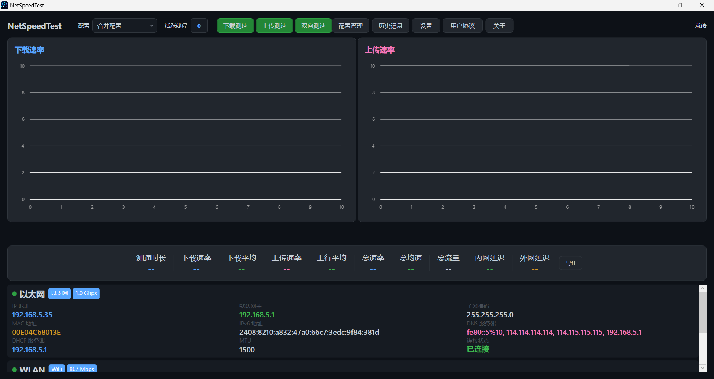

<div align="center">


# NetSpeedTest

**Windows 桌面端网络测速工具**

[](LICENSE)
[](https://dotnet.microsoft.com)
[](https://github.com/lingyingaojue/NetSpeedTest)
[](https://github.com/lingyingaojue/NetSpeedTest/releases)

</div>

---

<p align="center">
  <b>CDN 多节点并发</b> &nbsp;·&nbsp;
  <b>自适应线程调度</b> &nbsp;·&nbsp;
  <b>掉速智能补偿</b> &nbsp;·&nbsp;
  <b>全网卡实时监控</b> &nbsp;·&nbsp;
  <b>SQLite 历史管理</b>
</p>

---



---

## ✨ 核心亮点

<table>
<tr>
<td width="50%">

### 🚀 智能测速引擎
- **128 线程并发** HTTP GET/POST，多 URL 轮询
- **自适应线程上限** — 根据 CPU 性能动态调整，低配不反噬
- **掉速紧急补偿** — 检测骤降 → 自动加线程 → 结果修正
- **10s 稳定后取均值**，排除爬坡干扰
- **3s 滑动窗口平滑**，实时速率去毛刺
- **渐变启动**（200ms 可配），避免瞬时占满带宽

### 📊 NIC 级精准计量
- 基于 `IPv4Statistics` 差分计算，不受 HTTP 开销干扰
- 实时上下行 Mbps 显示，自动切换 Kbps / Mbps / Gbps
- **多网卡信息卡** — 9 项详情，彩色分类布局
- 每网卡独立速率条 + 活跃线程计数

</td>
<td width="50%">

### 🎨 专业交互体验
- **LiveCharts2 双折线图**，200ms 采样，500 点窗口
- 下载/上传图表**可拖拽分割线**
- 模式切换 **300ms 平滑过渡动画**
- **测速互斥回调** — 单测时只显示当前方向数值
- **暗色主题** — GitHub Dark 风格

### 🌐 全链路延迟检测
- **内网延迟** — ICMP → TCP 443 → HTTPS HEAD → HTTP HEAD 四层回退
- **外网延迟** — 12 个公网目标并发 Ping，取最低值

### 🗄️ 历史 & 配置管理
- SQLite 持久化，历史记录独立页面 + 一键清除
- 8 个内置 CDN 节点，支持自定义配置导入/导出（JSON 兼容 HBCS）

</td>
</tr>
</table>

---

## ⚙️ 可调参数

| 参数 | 范围 | 默认值 |
|:-----|:----:|:------:|
| 并发线程数 | 1 – 512 | **128** |
| 整体超时 | 10 – 600 s | **60 s** |
| 线程启动间隔 | 0 – 2000 ms | **500 ms** |
| 平均计量延迟 | 1 – 30 s | **10 s** |
| 速率平滑窗口 | 0.5 – 10 s | **3.0 s** |
| 网卡轮询间隔 | 200 – 5000 ms | **1000 ms** |

---

## 🛠 技术架构

| 层级 | 技术 |
|:-----|:-----|
| 运行时 | .NET 8.0‑windows |
| UI 框架 | WPF |
| 架构模式 | MVVM（CommunityToolkit.Mvvm 源码生成器） |
| 实时图表 | LiveChartsCore.SkiaSharpView.WPF |
| 数据持久化 | Microsoft.Data.Sqlite |
| DI & 配置 | Microsoft.Extensions.* |

---

## 🚀 快速开始

```bash
git clone https://github.com/lingyingaojue/NetSpeedTest.git
cd NetSpeedTest
dotnet restore
dotnet build
dotnet run --project NetSpeedTest/NetSpeedTest.csproj
```

> **环境要求**：Windows 10 / 11 · [.NET 8 SDK](https://dotnet.microsoft.com/download/dotnet/8.0)

---

## 📥 下载

前往 [Releases](https://github.com/lingyingaojue/NetSpeedTest/releases) 下载已编译版本（.NET 8 单文件发布，~170 MB）。

---

## 📄 许可证

[MIT License](LICENSE) &nbsp;·&nbsp; © 2026 lingyingaojue
