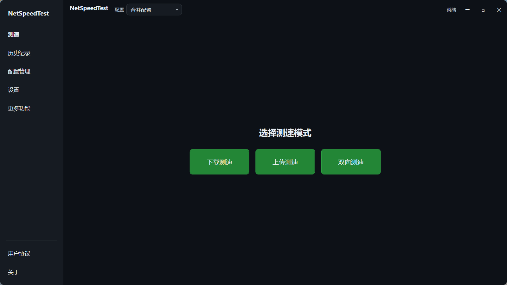

<div align="center">


# 🚀 NetSpeedTest

**Windows 桌面端网络测速工具 · 专业级 · 开源免费**

[](LICENSE)
[](https://dotnet.microsoft.com)
[](https://github.com/lingyingaojue/NetSpeedTest)
[](https://github.com/lingyingaojue/NetSpeedTest/releases)
[](https://github.com/lingyingaojue/NetSpeedTest/stargazers)
[](https://github.com/lingyingaojue/NetSpeedTest/releases)
[](https://github.com/lingyingaojue/NetSpeedTest/commits)
[](https://github.com/lingyingaojue/NetSpeedTest)

</div>

---

<p align="center">
  <b>CDN 智能调度</b> &nbsp;·&nbsp;
  <b>自适应线程引擎</b> &nbsp;·&nbsp;
  <b>掉速紧急补偿</b> &nbsp;·&nbsp;
  <b>UDP 五层延迟探测</b> &nbsp;·&nbsp;
  <b>18 合 1 工具箱</b> &nbsp;·&nbsp;
  <b>OTA 在线升级</b>
</p>

---

## 📋 目录

- [✨ 核心亮点](#-核心亮点)
- [⌨️ 快捷键](#️-快捷键)
- [⚙️ 可调参数](#️-可调参数)
- [🛠 技术架构](#-技术架构)
- [🚀 快速开始](#-快速开始)
- [📥 下载](#-下载)
- [📝 更新日志](#-更新日志)

---



> 🖥️ v1.3.7 主界面：暗色主题 · 侧边栏导航 · 自绘标题栏（截图由用户实机提供）

---

## ✨ 核心亮点

<table>
<tr>
<td width="50%">

### 🚀 智能测速引擎
- **128 线程并发** HTTP GET/POST
- **URL 动态调度** — SelectBestUrl 按实时速度选最优节点
- **自适应线程上限** — 根据 CPU 性能动态调整，低配不反噬
- **掉速紧急补偿** — 检测骤降 → 自动加线程 → 结果修正
- **10s 稳定后取均值**，排除爬坡干扰
- **3s 滑动窗口平滑**，实时速率去毛刺
- **渐变启动**（200ms 可配），避免瞬时占满带宽

### 📊 NIC 级精准计量
- 基于 `IPv4Statistics` 差分计算，不受 HTTP 开销干扰
- 实时上下行 Mbps 显示，自动切换 Kbps / Mbps / Gbps
- **多网卡信息卡** — 9 项详情，彩色分类布局
- 每网卡独立速率条 + 活跃线程计数

</td>
<td width="50%">

### 🎨 专业交互体验
- **LiveCharts2 双折线图**，200ms 采样，500 点窗口
- 下载/上传图表**可拖拽分割线**
- 模式切换 **300ms 平滑过渡动画**
- **测速互斥回调** — 单测时自动隐藏无关指标
- **系统托盘驻留** — 右键菜单 / 状态联动 / 气泡通知
- 完成弹窗 **「复制结果」按钮**
- **暗色主题** — GitHub Dark 风格
- **内嵌页面架构** — 历史 / 配置 / 设置 / 更多 / 协议 / 关于 全部改为右侧内嵌页，告别弹窗
- **自绘标题栏 + 侧边栏导航** — Windows 风格窗口按钮，测速中自动禁用页面切换
- **GitHub OTA 在线升级** — 启动自动检查 + 关于页手动检查，发现新版本弹窗引导下载

### 🌐 全链路 UDP 优先延迟探测
- **统一五层回退**：UDP → ICMP → TCP 443 → HTTPS HEAD → HTTP HEAD
- **WAN / 抖动 / LAN 共用同一探测链路**，结果一致性更高
- **外网延迟** — 8.8.8.8 单主机 UDP 轮询，避免批量阻塞
- **抖动延迟** — 滑动窗口标准差算法，实时平滑输出
- **延迟刷新频率 1000ms**，三指标同步更新

### 🗄️ 历史 & 配置管理
- SQLite 持久化，独立页面 + 一键清除 + **统计栏** + CSV 导出
- 8 个内置 CDN 节点，支持自定义配置导入/导出（JSON 兼容 HBCS）
- 设置保存纯内存生效，不覆盖打包版默认值

</td>
</tr>
</table>

---

## 🛠️ 网络工具箱 (New in v1.3.5)

内置 **18 种专业网络诊断工具**，一窗口搞定日常排查：

<table>
<tr>
<td width="50%">

| 工具 | 说明 |
|:-----|:-----|
| 🏓 **Ping** | ICMP 连通性测试，自定义包大小/次数/TTL |
| 🌐 **DNS 查询** | A/AAAA/CNAME/MX/NS/TXT 记录查询 |
| 📡 **HTTP 请求** | GET/POST/PUT/DELETE，状态码/响应头/耗时 |
| 🗺️ **路由追踪** | Traceroute 跳点追踪，实时 IP/延迟 |
| 🔌 **端口测试** | TCP 端口扫描，自定义端口范围 |
| 📏 **MTU 探测** | 路径 MTU 自动探测，发现最优值 |
| 🔄 **DNS 对比** | 多 DNS 服务器结果并行对比 |
| 🌍 **IP 归属** | IP 地址地理信息/运营商查询 |
| 🌐 **公网 IP** | 多源探测当前公网出口 IP |

</td>
<td width="50%">

| 工具 | 说明 |
|:-----|:-----|
| 🔒 **SSL 证书** | HTTPS 证书链/过期时间/签名算法 |
| 📨 **HTTP Header** | 任意 URL 响应头完整查看 |
| 🧮 **子网计算** | CIDR 子网划分 / 可用地址计算 |
| 📊 **带宽换算** | Mbps/MBps/Kbps/GBps 实时换算 |
| 🕐 **时间戳** | Unix 时间戳 ↔ 日期 互转 |
| #️⃣ **文本哈希** | MD5/SHA1/SHA256/SHA512 在线计算 |
| 🔤 **Base64** | Base64 编解码 |
| 🆔 **UUID 生成** | UUID v4/v7 批量生成 |
| 🔍 **NAT 检测** | STUN NAT 类型（全锥/受限/对称），自定义服务器 |

</td>
</tr>
</table>

> 💡 测速前自动弹出**准备弹窗**：DNS 预解析 + HTTP 握手预热 + 线性进度条，准备中途关闭即停止。

---

## ⌨️ 快捷键

| 快捷键 | 功能 |
|:------|:-----|
| <kbd>Enter</kbd> | 开始测速 |
| <kbd>Esc</kbd> | 停止测速 |
| <kbd>Ctrl</kbd> + <kbd>D</kbd> | 仅下载 |
| <kbd>Ctrl</kbd> + <kbd>U</kbd> | 仅上传 |
| <kbd>Ctrl</kbd> + <kbd>B</kbd> | 全速双向 |

---

## ⚙️ 可调参数

| 参数 | 范围 | 默认值 |
|:-----|:----:|:------:|
| 并发线程数 | 1 – 512 | **128** |
| 整体超时 | 10 – 600 s | **60 s** |
| 线程启动间隔 | 0 – 2000 ms | **500 ms** |
| 平均计量延迟 | 1 – 30 s | **10 s** |
| 速率平滑窗口 | 0.5 – 10 s | **3.0 s** |
| 网卡轮询间隔 | 200 – 5000 ms | **1000 ms** |
| 抖动探测主机 | — | **8.8.8.8** |
| 抖动采样间隔 | 1 – 60 s | **5 s** |

---

## 🛠 技术架构

| 层级 | 技术 |
|:-----|:-----|
| 运行时 | .NET 8.0‑windows |
| UI 框架 | WPF |
| 架构模式 | MVVM（CommunityToolkit.Mvvm 源码生成器） |
| 实时图表 | LiveChartsCore.SkiaSharpView.WPF |
| 数据持久化 | Microsoft.Data.Sqlite |
| DI & 配置 | Microsoft.Extensions.* |

---

## 🚀 快速开始

```bash
git clone https://github.com/lingyingaojue/NetSpeedTest.git
cd NetSpeedTest
dotnet restore
dotnet build
dotnet run --project NetSpeedTest/NetSpeedTest.csproj
```

> [!NOTE]
> **环境要求**：Windows 10 / 11 · [.NET 8 SDK](https://dotnet.microsoft.com/download/dotnet/8.0)

---

## 📥 下载

前往 [Releases](https://github.com/lingyingaojue/NetSpeedTest/releases) 下载已编译版本（.NET 8 单文件发布，~170 MB）。

---

## 📝 更新日志

完整变更记录请查看 [CHANGELOG.md](CHANGELOG.md)。

---

## 📄 许可证

[MIT License](LICENSE) &nbsp;·&nbsp; © 2026 lingyingaojue
