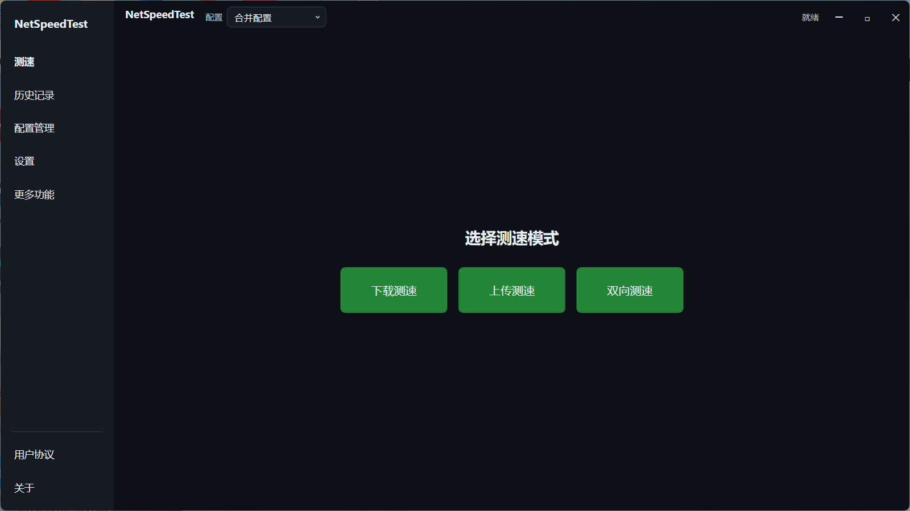

<div align="center">


# 🚀 NetSpeedTest

**Windows 桌面端网络测速工具 · 专业级 · 开源免费**

[](LICENSE)
[](https://dotnet.microsoft.com)
[](https://github.com/lingyingaojue/NetSpeedTest)
[](https://github.com/lingyingaojue/NetSpeedTest/releases)
[](https://github.com/lingyingaojue/NetSpeedTest/stargazers)
[](https://github.com/lingyingaojue/NetSpeedTest/releases)
[](https://github.com/lingyingaojue/NetSpeedTest/commits)
[](https://github.com/lingyingaojue/NetSpeedTest)

</div>

---

<p align="center">
  <b>CDN 智能调度</b> &nbsp;·&nbsp;
  <b>自适应线程引擎</b> &nbsp;·&nbsp;
  <b>多网卡并行测速</b> &nbsp;·&nbsp;
  <b>掉速紧急补偿</b> &nbsp;·&nbsp;
  <b>UDP 五层延迟探测</b> &nbsp;·&nbsp;
  <b>18 合 1 工具箱</b> &nbsp;·&nbsp;
  <b>Web 远程控制台</b> &nbsp;·&nbsp;
  <b>OTA 在线升级</b>
</p>

---

## 📋 目录

- [✨ 核心亮点](#-核心亮点)
- [🌐 Web 服务器与远程控制台](#-web-服务器与远程控制台)
- [🛠️ 网络工具箱](#️-网络工具箱)
- [⌨️ 快捷键](#️-快捷键)
- [⚙️ 可调参数](#️-可调参数)
- [🗂️ 数据与配置文件](#️-数据与配置文件)
- [🏗️ 技术架构](#️-技术架构)
- [🚀 快速开始](#-快速开始)
- [📥 下载](#-下载)
- [📝 更新日志](#-更新日志)
- [💬 反馈与联系](#-反馈与联系)
- [📄 许可证](#-许可证)

---



> 🖥️ 主界面：暗色主题 · 侧边栏导航 · 自绘标题栏（截图由用户实机提供）

---

## ✨ 核心亮点

<table>
<tr>
<td width="50%">

### 🚀 智能测速引擎
- **HTTP GET/POST 并发压测**，线程数默认 128，自适应模式最高 1024
- **URL 轮转调度 + 健康度评分** — 每个 worker 取用后前进游标，连续失败的节点进入冷却期并自动降权
- **自适应线程上限** — 从起始线程数线性加压，低配机器不反噬
- **掉速紧急补偿** — 检测速率跌破峰值阈值 → 自动加线程 → 结果修正
- **排除爬坡干扰取均值** — 按「平均计量延迟」跳过起始爬坡段后计算平均速率，掉速时长同时从分母中扣除
- **滑动窗口平滑** — 实时速率去毛刺，默认 3 秒窗口
- **渐变启动** — 线程按间隔分批就绪，避免瞬时占满带宽

### 🌐 多网卡并行测速 *(v1.4.0)*
- **多网卡同时测速** — 勾选多张网卡并行测速，每张网卡独立绑定源 IP
- **虚拟网卡可开关** — 默认过滤，可在设置中放行
- **曲线按网卡切换** — 下载/上传图表支持「合计 / 单网卡」曲线切换
- **总速度显示** — 双向测速时显示下载 + 上传总速度
- **完成弹窗每网卡结果** — 每张网卡独立速率/错误信息一目了然
- **默认优先默认网关网卡** — 自动选中有默认网关的网卡
- **单卡失败不拖垮整体** — 单张网卡异常时其余网卡继续完成

### 📊 NIC 级精准计量
- 基于 `IPv4Statistics` 差分计算，不受 HTTP 开销干扰
- 实时上下行 Mbps 显示，自动切换 Kbps / Mbps / Gbps
- **多网卡信息卡** — IP / 网关 / 掩码 / MAC / IPv6 / DNS / DHCP / MTU / 状态 9 项详情
- 每网卡独立速率条 + 活跃线程计数

</td>
<td width="50%">

### 🌐 全链路 UDP 优先延迟探测
- **统一五层回退**：UDP → ICMP → TCP 443 → HTTPS HEAD → HTTP HEAD
- **WAN / 抖动 / LAN 共用同一探测链路**，结果一致性更高
- **外网延迟** — 单主机 UDP 轮询，避免批量阻塞
- **抖动延迟** — 滑动窗口标准差算法，实时平滑输出
- **丢包率实时监测** — 5 包/批探测，ICMP 优先，首轮全失败自动切 UDP 复核
- **网卡独立指标** *(v1.4.2)* — 每张网卡分别显示内网延迟、外网延迟、抖动与丢包率

### 🎨 专业交互体验
- **LiveCharts2 双折线图**，200ms 采样、500 点滑动窗口
- 下载/上传图表**可拖拽分割线**，模式切换 **300ms 平滑过渡动画**
- **内嵌页面架构** — 历史 / 配置 / 设置 / Web 服务器 / 更多 / 协议 / 关于 全部为右侧内嵌页，告别弹窗
- **自绘标题栏 + 侧边栏导航** — Windows 风格窗口按钮，测速中自动禁用页面切换
- **系统托盘驻留** — 右键菜单 / 状态联动 / 气泡通知
- **深/浅主题切换** — 即时切换且持久化，启动自动恢复
- **中英双语界面** — 简体中文 / English 一键切换，选择持久化
- **GitHub OTA 在线升级** — 启动自动检查 + 关于页手动检查，发现新版本弹窗引导下载

### 🗄️ 历史 & 配置管理
- SQLite 持久化，独立页面 + 一键清除 + **统计栏** + CSV 导出
- 8 个内置 CDN 节点，支持自定义配置导入/导出（JSON 兼容 HBCS）
- 设置以「临时文件 + 原子替换」落盘，异常中断不丢配置
- 多网卡导出包含聚合结果 + 每网卡明细 + BatchId

</td>
</tr>
</table>

> 💡 测速前自动弹出**准备弹窗**：URL 预探测 + DNS 预解析 + HEAD 握手预热 + 线性进度条；准备阶段（最长 15 秒）也可直接取消。

---

## 🌐 Web 服务器与远程控制台

内置 HTTP 服务器（默认开启，`HttpListener` 实现，**无需额外安装任何运行时组件**），手机或同网段电脑用浏览器即可远程查看与操控测速。

| 能力 | 说明 |
|:-----|:-----|
| 🖥️ **Web 控制台** | 访问 `http://<本机IP>:8080` 实时查看速率曲线、网卡状态、历史记录 |
| 🔀 **端口自动避让** | 默认端口被占用时自动顺延探测可用端口，实际生效端口持久化并在界面回显 |
| ⚙️ **自定义端口** | 支持在 Web 服务器页指定固定端口（1024 – 65535） |
| 🔐 **会话令牌保护** | 非回环的写操作必须携带启动时随机生成的 `X-NST-Token`（256 位），防止局域网内跨源静默触发测速或删数据；回环访问免令牌 |
| 🛡️ **局域网访问控制（ACL）** | 按本机网卡网段生成访问清单，仅允许同网段设备访问，其他来源返回 403；并自动探测防火墙放行状态 |
| 📄 **可改页面** | 网页位于 exe 同目录 `wwwroot\index.html`，可直接修改无需重新编译；发布版也内嵌一份兜底 |
| 🔒 **安全响应头** | 全量响应附带 `X-Content-Type-Options: nosniff`、`X-Frame-Options: DENY`、`Referrer-Policy: no-referrer` |
| 🚫 **SSRF 防护** | 关闭自动重定向并逐跳校验（最多 3 跳），拦截回环/私网/保留网段/CGNAT/组播/IPv6 私有地址，目标端口限定 80/443 |

### REST API

| 方法 | 路径 | 说明 |
|:-----|:-----|:-----|
| `GET` | `/api/status` | 测速状态、实时速率、当前端口 |
| `GET` | `/api/adapters` | 网卡列表与选中状态 |
| `POST` | `/api/adapters/select` | 切换要参与测速的网卡 |
| `GET` | `/api/profiles` | 读取测速配置列表 |
| `POST` | `/api/profiles` | 新增/保存测速配置 |
| `GET` | `/api/history` | 分页读取历史记录（`?page=&pageSize=`） |
| `DELETE` | `/api/history` | 清除历史记录 |
| `GET` | `/api/settings` | 读取当前测速参数 |
| `POST` | `/api/settings` | 写入测速参数（并发写安全、原子落盘） |
| `POST` | `/api/test/start` | 开始测速（真正进入运行态后才返回 200，重复调用返回 409） |
| `POST` | `/api/test/stop` | 停止测速（准备阶段同样可取消） |
| `GET` | `/api/server` | 服务器端口、局域网状态与网卡网段绑定 |

> 🧪 所有接口均：
> - 对 UI 线程等待统一带 **2 秒超时**，超时返回 503 而不是一直挂起；单请求带 **30 秒** 请求级超时
> - 错误信息对外脱敏为分类文案，细节只写入日志
> - 请求体上限 256 KB，超限或格式错误返回 400

---

## 🛠️ 网络工具箱

内置 **18 种专业网络诊断工具**，一窗口搞定日常排查：

<table>
<tr>
<td width="50%">

| 工具 | 说明 |
|:-----|:-----|
| 🏓 **Ping** | ICMP 连通性测试，自定义目标与次数，输出逐包 RTT 与 TTL |
| 🌐 **DNS 查询** | 域名 A / AAAA 地址解析，含耗时与地址族 |
| 📡 **HTTP 请求** | HEAD 请求探测，输出状态码 / 响应时间 / Server / Content-Type / Content-Length |
| 🗺️ **路由追踪** | ICMP TTL 逐跳追踪（最多 30 跳），实时显示跳点 IP / 延迟 / TTL |
| 🔌 **端口测试** | TCP 端口连通性测试，自定义主机与端口（1 – 65535） |
| 📏 **MTU 探测** | 二分法路径 MTU 探测（68 – 1500，禁止分片） |
| 🔄 **DNS 对比** | 8.8.8.8 / 114.114.114.114 / 1.1.1.1 / 223.5.5.5 四路延迟横向对比 |
| 🌍 **IP 归属** | IP 地理位置 / 运营商 / AS / 时区查询 |
| 🌐 **公网 IP** | ipify / ipip / ifconfig.me 三源探测出口 IP，交叉验证减少 CDN 干扰 |

</td>
<td width="50%">

| 工具 | 说明 |
|:-----|:-----|
| 🔒 **SSL 证书** | 证书颁发者 / 主题 / 生效与到期时间 / 剩余天数 / 序列号 / 签名算法 |
| 📨 **HTTP Header** | 任意 URL 响应头完整查看 |
| 🧮 **子网计算** | IP + 掩码 → 网络地址 / 广播地址 / 可用主机数与范围（含 /31、/32） |
| 📊 **带宽换算** | Mbps ↔ MB/s · KB/s · Gbps · KBps，并估算 100 MB 文件耗时 |
| 🕐 **时间戳** | Unix 秒级 / 毫秒级时间戳 ↔ 日期 双向转换 |
| #️⃣ **文本哈希** | MD5 / SHA1 / SHA256 计算 |
| 🔤 **Base64** | Base64 编解码 |
| 🆔 **UUID 生成** | UUID v4 批量生成（1 – 50 个） |
| 🔍 **NAT 检测** | STUN（RFC 5389）判定**映射行为**（锥形 / 对称）、端口保留、Hairpin 自返与 STUN/TCP 可用性；Google + 小米双服务器（可自定义），并与 HTTP 出口 IP 交叉验证 |

</td>
</tr>
</table>

---

## ⌨️ 快捷键

| 快捷键 | 功能 |
|:------|:-----|
| <kbd>Enter</kbd> | 开始测速（下载模式，等同 <kbd>Ctrl</kbd>+<kbd>D</kbd>） |
| <kbd>Esc</kbd> | 停止测速 |
| <kbd>Ctrl</kbd> + <kbd>D</kbd> | 仅下载 |
| <kbd>Ctrl</kbd> + <kbd>U</kbd> | 仅上传 |
| <kbd>Ctrl</kbd> + <kbd>B</kbd> | 全速双向 |

> 在文本框内输入时不会误触发。

---

## ⚙️ 可调参数

「范围」为设置页滑块的可调区间；「默认值」为内置 `appsettings.json` 的出厂值。标为*(派生)*的行不可直接编辑，仅说明引擎行为。

| 参数 | 范围 | 默认值 |
|:-----|:----:|:------:|
| 并发线程数 | 2 – 1024 | **128** |
| 测速时长 | 10 – 600 s | **60 s** |
| 线程启动间隔 | 0 – 2000 ms | **50 ms** |
| 平均计量延迟 | 1 – 30 s | **10 s** |
| 速率平滑窗口 | 0.5 – 10 s | **3.0 s** |
| 网卡轮询间隔 | 200 – 5000 ms | **1000 ms** |
| 延迟轮询间隔 | 500 – 10000 ms | **1000 ms** |
| 抖动采样间隔 | 500 – 5000 ms | **1000 ms** |
| 抖动探测主机 | — | **8.8.8.8** |
| 丢包率监测地址 | — | **8.8.8.8** |
| 丢包率轮询间隔 | 500 – 5000 ms | **1000 ms** |
| 补偿阈值 | 0.3 – 0.8 | **0.5** |
| 确认时长 | 1 – 10 s | **3 s** |
| 自适应线程上限 *(派生)* | 128 / 256 / 512 / 1024 阶梯 | **1024** |
| 自适应起始线程数 | 1 – 自适应上限 | **2** |
| Web 服务器端口 | 1024 – 65535 | **8080** |

> **自适应线程上限**由引擎派生：单网卡为 1024，多网卡按网卡份额折算；开启自适应后「并发线程数」不生效，线程从起始线程数起步按 128 / 256 / 512 / 1024 阶梯扩容。<br>
> **Web 服务器端口**在「Web 服务器」页设置（自动避让或自定义）；其余参数在「设置」页调整。<br>
> 导入的自定义配置 URL 会经过与 Web API 相同的 SSRF 校验。

---

## 🗂️ 数据与配置文件

全部用户数据位于 `%LOCALAPPDATA%\NetSpeedTest\`：

| 文件 | 说明 |
|:-----|:-----|
| `NetSpeedTest.db` | SQLite 数据库：测速历史、自定义配置（WAL 模式 + busy_timeout） |
| `appsettings.json` | 用户在设置页保存的参数覆盖层（原子写入） |
| `web.json` | Web 服务器开关、端口模式与局域网访问设置 |
| `theme.json` / `language.json` | 主题与界面语言选择 |

> 程序内嵌一份默认 `appsettings.json`，与用户覆盖层合并生效，卸载或删除用户目录即恢复出厂设置。<br>
> 加 `--debug` 启动参数可在 exe 同级目录生成 `debug.log` 日志。

---

## 🏗️ 技术架构

| 层级 | 技术 |
|:-----|:-----|
| 运行时 | .NET 8.0‑windows |
| UI 框架 | WPF（自绘标题栏 + 侧边栏内嵌页） |
| 架构模式 | MVVM（CommunityToolkit.Mvvm 源码生成器，DI 容器 `Microsoft.Extensions.DependencyInjection`） |
| 实时图表 | LiveChartsCore.SkiaSharpView.WPF |
| 数据持久化 | Microsoft.Data.Sqlite |
| 配置系统 | Microsoft.Extensions.Configuration（内嵌默认值 + 用户覆盖层） |
| Web 服务器 | `System.Net.HttpListener` + 内嵌 `wwwroot` 静态资源 |
| 测试框架 | xUnit（`NetSpeedTest.Tests`） |

---

## 🚀 快速开始

### 环境要求

Windows 10 / 11 · [.NET 8 SDK](https://dotnet.microsoft.com/download/dotnet/8.0)

### 构建与运行

```powershell
git clone https://github.com/lingyingaojue/NetSpeedTest.git
cd NetSpeedTest
dotnet restore
dotnet build
dotnet run --project NetSpeedTest\NetSpeedTest.csproj
```

调试日志：

```powershell
dotnet run --project NetSpeedTest\NetSpeedTest.csproj -- --debug
```

### 运行测试

```powershell
dotnet test NetSpeedTest.Tests\NetSpeedTest.Tests.csproj
```

测试覆盖自适应线程控制器、双向自适应反馈、设置原子持久化、SSRF 防护、UDP 探测、上传校验、URL 明细、Web 安全与版本一致性等回归场景。

### 发布单文件版

```powershell
dotnet publish NetSpeedTest\NetSpeedTest.csproj -c Release -r win-x64 --self-contained true `
  -p:PublishSingleFile=true -p:IncludeNativeLibrariesForSelfExtract=true
```

产物为单个自包含 exe（约 170 MB），目标机器无需预装 .NET 运行时。

### 端到端验证脚本

`tools\` 下提供针对真实 Release 构建的联调脚本（需要管理员权限以放行 HTTP.sys 端口）：

| 脚本 | 用途 |
|:-----|:-----|
| `tools\smoke-test.ps1` | 启动真实程序并驱动 Web API：令牌校验、安全响应头、输入校验、测速生命周期、并发设置写入、负载可用性、日志 FATAL 扫描 |
| `tools\verify-version.ps1` | 校验版本号贯穿 csproj → exe 文件属性 → Web 控制台 → 静态资源 |
| `tools\verify-token.ps1` | 校验会话令牌在真实局域网 HTTP 请求下的强制生效 |
| `tools\verify-extra.ps1` | 补充场景验证 |

---

## 📥 下载

前往 [Releases](https://github.com/lingyingaojue/NetSpeedTest/releases) 下载已编译的单文件版本（.NET 8 自包含发布，约 170 MB），开箱即用。

官网 / 落地页：<https://lingyingaojue.github.io/NetSpeedTest/>

---

## 📝 更新日志

完整变更记录请查看 [CHANGELOG.md](CHANGELOG.md)。当前版本 **v1.4.2** 重点修复了双向测速上传偏低、丢包率恒为 100%、测速启动假成功、设置写入非原子等问题。

---

## 💬 反馈与联系

| 渠道 | 地址 |
|:-----|:-----|
| 🐛 Issue | <https://github.com/lingyingaojue/NetSpeedTest/issues> |
| 📧 邮箱 | mashuo2010az@163.com |
| 💬 微信 / QQ | Smailboy2010 |
| 👥 QQ 交流群 | 见 [落地页「找到我们」](https://lingyingaojue.github.io/NetSpeedTest/#contact) 二维码 |

> 应用内「关于」页的联系方式支持一键复制到剪贴板。

---

## 📄 许可证

[MIT License](LICENSE) &nbsp;·&nbsp; © 2026 lingyingaojue
